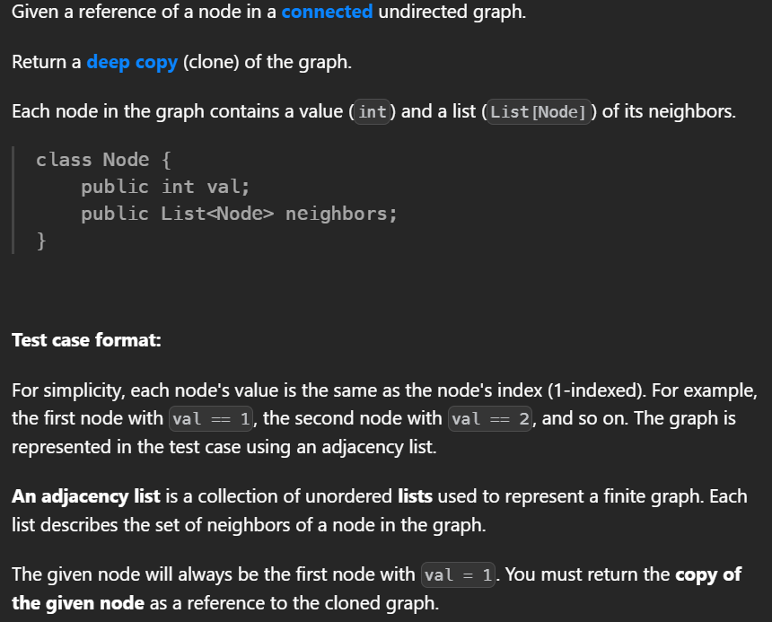
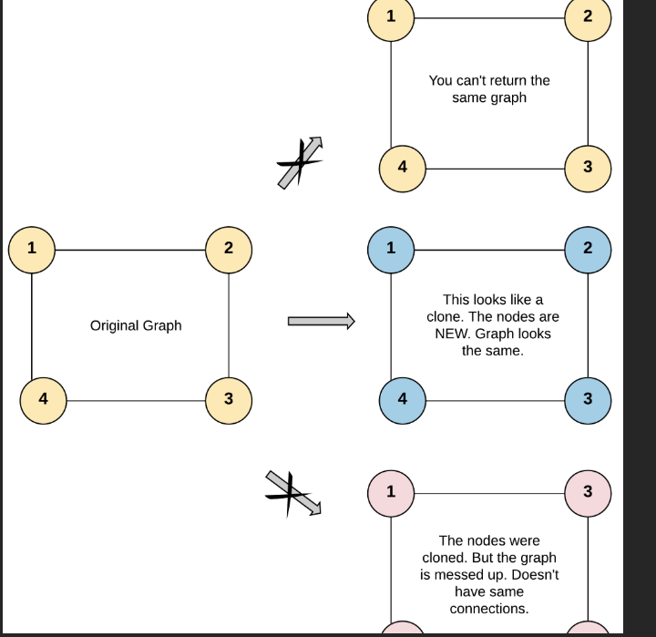
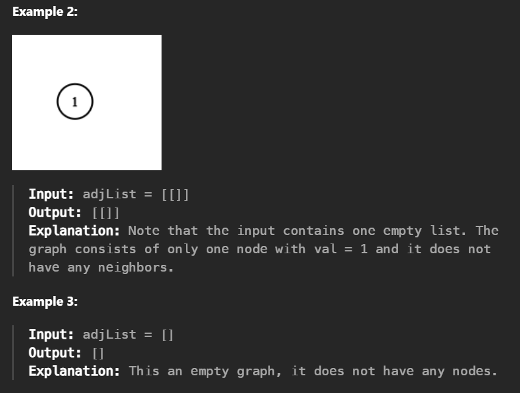
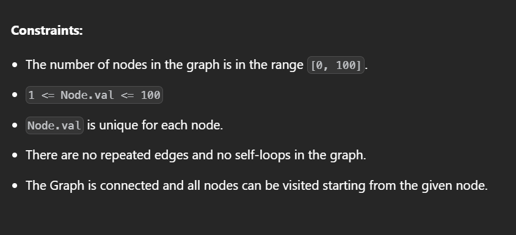
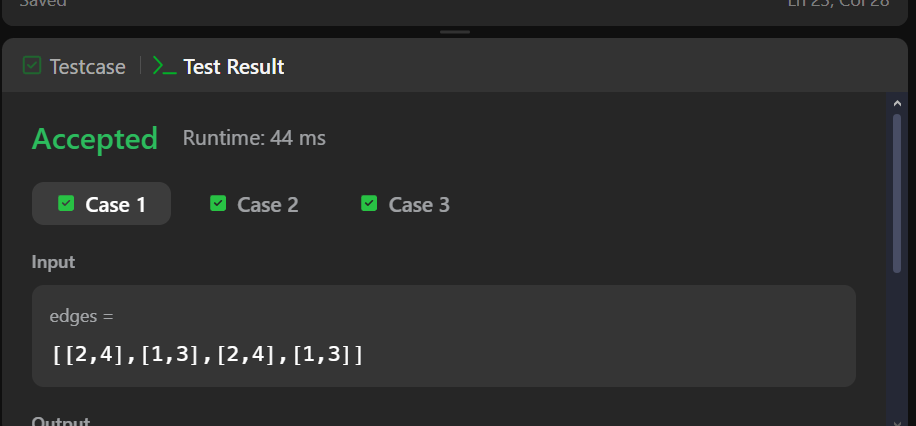
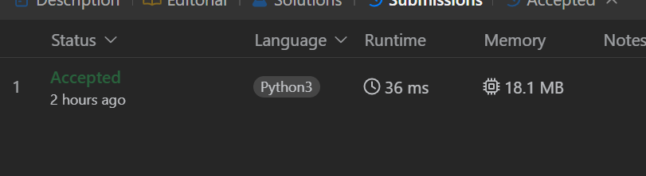

## 133. Clone Graph

A questão foi resolvida no LeetCode, onde você pode conferir o enunciado completo.

[Clique aqui](https://leetcode.com/problems/clone-graph/description/?envType=problem-list-v2&envId=graph)

## Dificuldade 

Media

## Enunciado

## Exemplos 

## Restrições

## Submissões

