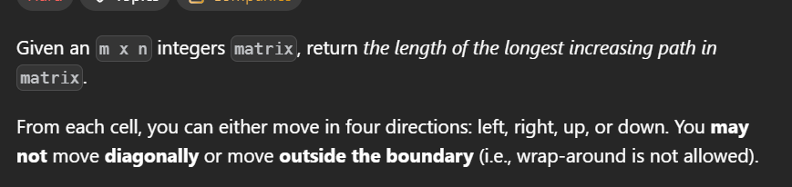
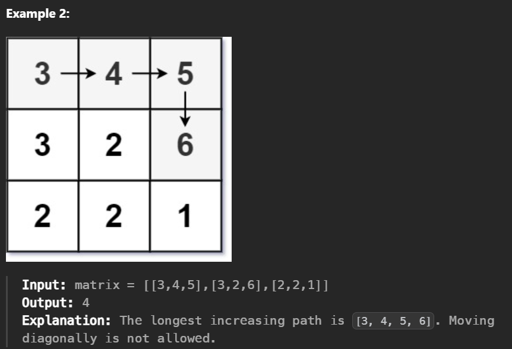
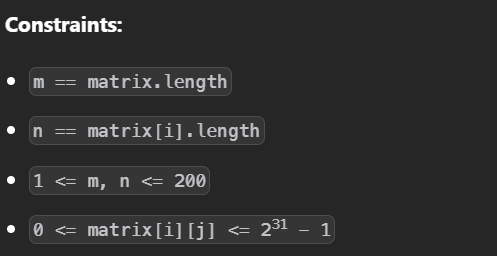
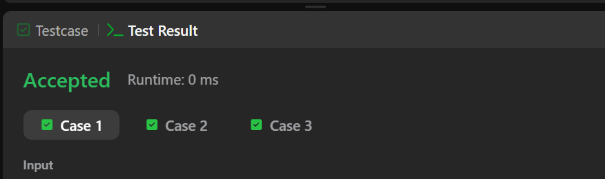
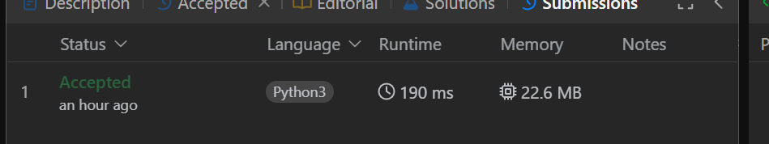

## 329. Longest Increasing Path in a Matrix

A questão foi resolvida no LeetCode, onde você pode conferir o enunciado completo.

[Clique aqui](https://leetcode.com/problems/longest-increasing-path-in-a-matrix/submissions/?envType=problem-list-v2&envId=graph)

## Dificuldade 

Deficil

## Enunciado

## Exemplos 

## Restrições

## Submissões

